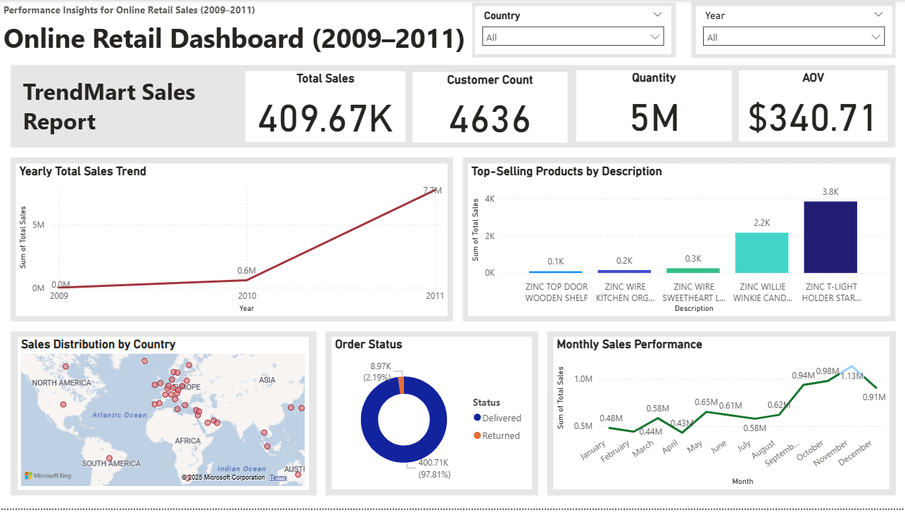

# 📊 Online Retail Dashboard (2009–2011)

An interactive **Power BI dashboard** providing insights into **sales performance, customer behavior, product trends, and order status** for an online retail store.  

This project showcases my skills in **data visualization, analytics, and storytelling** using real-world e-commerce data.  

---

## 🚀 Key Features
- **Total Sales, Customer Count, Quantity & AOV** at a glance  
- **Yearly Total Sales Trend** for understanding growth over time  
- **Top-Selling Products** by description  
- **Sales Distribution by Country** (map visualization)  
- **Order Status** breakdown (Delivered vs Returned)  
- **Monthly Sales Performance** for seasonality analysis  

---

## 🗂 Dataset
- Source: [Kaggle – Online Retail Dataset](https://www.kaggle.com/datasets/vijayuv/onlineretail)  
- Data covers transactions from **2009 to 2011**.

---

## 🛠 Tools & Technologies
- **Power BI** – Dashboard creation & interactive reporting  
- **Excel / CSV** – Data preprocessing  
- **Kaggle** – Open dataset  

---

## 📷 Dashboard Preview

---

## 📜 License
This project is licensed under the [MIT License](LICENSE).

---

⭐ **If you find this project helpful, don’t forget to star the repository!**  
